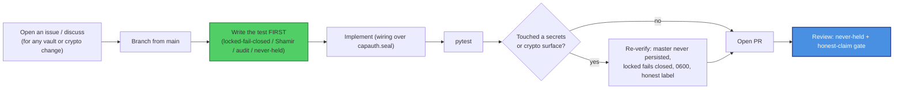

# Contributing to skvault

Thanks for helping with `skvault` — the SKWorld **secrets vault** (KeePass creds + Shamir
social recovery + TOTP, built on `capauth.seal`). This is **secrets-handling
infrastructure**, so the bar is higher than a typical package: the never-holds-master
invariant and the honest-claim rules are **non-negotiable**.

By participating you agree to the [Code of Conduct](CODE_OF_CONDUCT.md). All contributions
are licensed under **GPL-3.0-or-later** (this repo's recorded license — chosen for
compatibility with its `capauth` and `pykeepass` dependencies).

---

## Ground rules (read before you write code)

1. **We never hand-roll, and never duplicate, encryption.** Every seal/unseal goes through
   **`capauth.seal`** — there must remain exactly **one** encryption implementation in the
   stack. Do not add a second seal path, a home-grown cipher, or a parallel key-wrap. The
   only original crypto in this repo is the **Shamir** GF(256) split/combine (pure-Python,
   auditable, no deps) and the **RFC 6238 TOTP** verifier — touch those only with tests.
2. **The KeePass master is never held.** It is sealed to your PGP key and unsealable only
   while the vault is unlocked. No code path may store, cache, log, or persist the master
   (or the vault passphrase). Unsealed values are transient and `del`'d. (Tested invariant
   — keep it green.)
3. **Locked means no access.** `creds-get` / `creds-list` MUST fail closed when
   `vault_unlocked()` is not `True`. Never widen access while locked.
4. **Audit everything.** Every `init` / `get` / `list` appends to
   `~/clawd/logs/keepass-access.log`. Do not add a silent access path.
5. **Permissions are `0600`.** Sealed blobs, the TOTP seed, the word-blob, and Shamir
   shares are written `0600`. Keep it that way.
6. **Transition-safety.** The live vault was set up under `skingest`; the `SKVAULT_*→
   SKINGEST_*` env fallbacks and the legacy `~/.config/skmemory/` blob paths exist for live
   continuity — do not break reads from the legacy locations.

### Claim-language discipline (hard rule)

In code, comments, docstrings, docs, **and commit messages**:

- ✅ Say **"quantum-resistant" / "post-quantum."**
- ❌ Never say **"quantum-proof," "quantum-safe," "unbreakable,"** or **"CNSA 2.0
  compliant."**
- The **seal surface is classical** (delegated to `capauth`) — never describe it as
  quantum-resistant. skvault is a **vault, not a KEM or transport** — never imply it defends
  Harvest-Now-Decrypt-Later or establishes session secrets.
- Every claim cites **surface + FIPS/RFC number + hybrid-vs-classical**, backed by a
  self-report command (`skvault status` / `creds-status`).
- The **experimental / unaudited** banner stays in README, SOP, and SECURITY until a real
  third-party audit lands.

Reviewers will block a PR that introduces a forbidden word or an over-claim, even in a
comment.

---

## Development workflow



### Setup

```bash
git clone https://github.com/smilinTux/skvault
cd skvault
python -m venv .venv && . .venv/bin/activate
pip install -e ".[dev]"
pytest
```

System prerequisites: GnuPG (`gpg`, `gpgconf`, `gpg-preset-passphrase`); `qrencode`
optional (TOTP QR). `capauth` must be importable (it's a dependency).

---

## What a good PR looks like

- **Scoped.** One logical change; secrets/crypto-surface changes discussed in an issue
  first.
- **Tested.** New behavior has a test; bug fixes add a regression test that fails before and
  passes after; the never-held / fail-closed invariants stay green.
- **Honest.** No new claim exceeds the evidence; no forbidden words; the classical seal
  surface is not described as quantum-resistant; the unaudited banner intact.
- **Documented.** README / SOP / CHANGELOG / `docs/crypto-architecture.md` updated when
  behavior or a surface changes.

### Out of scope (by design)

- A **second** encryption implementation, a home-grown cipher, or a parallel seal path.
- Making `skvault` a network service, a KEM, a transport, or an identity authority (that's
  `capauth`).
- Any path that holds, caches, or persists the KeePass master or the vault passphrase.

---

## Commits

- **Conventional, imperative subject lines** (`fix:`, `feat:`, `test:`, `docs:`). Reference
  the issue; isolate crypto changes from refactors.
- **Honest-claim discipline applies to commit messages too.**
- When a contribution is co-authored by an AI agent, end the commit with the trailer:

  ```
  Co-Authored-By: Claude Opus 4.8 <noreply@anthropic.com>
  ```

  (Credit every co-author with a `Co-Authored-By:` trailer.)

---

## Reporting security issues

**Do not** open a public issue for a vulnerability. Follow [SECURITY.md](SECURITY.md)
(private GitHub Security Advisory or maintainer email, coordinated disclosure).

Thanks for keeping secrets sovereign and the crypto honest. 🐧 **SK =
staycuriousANDkeepsmilin**
