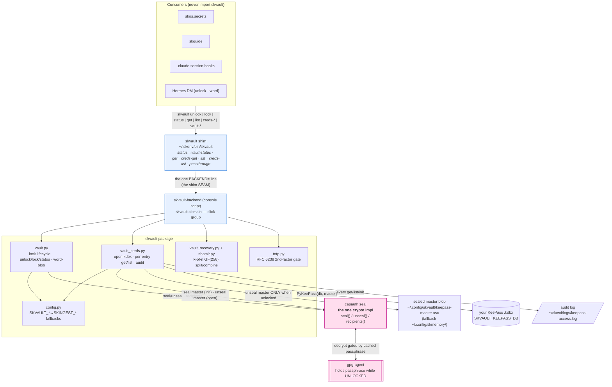

# skvault — Standard Operating Procedures

The SKWorld **secrets vault**: a KeePass-backed credential store + sovereign Shamir
social-recovery + TOTP 2nd factor, built **on top of** `capauth.seal`. The user-facing
entry point is the stable `skvault` shim (`~/.skenv/bin/skvault`), which delegates to the
`skvault-backend` console script (`skvault.cli:main`). Called by `skos.secrets`, `skguide`,
the `.claude` session hooks, and the Hermes DM unlock path.

---

## 1. Overview

**Purpose.** Give an agent *use-time* access to your real credentials **without** the agent
ever holding your KeePass master password, and give you a sovereign way to recover the vault
passphrase if your key is lost — all without inventing any new cryptography.

### ▶ skvault is the fleet's credential vault. This is the only home for it.

If you are looking for KeePass `.kdbx` access, Shamir k-of-n social recovery, or TOTP,
**they live here and nowhere else.** That is worth stating plainly, because they used to
live somewhere else and stale muscle memory still sends people there:

- They were **stripped out of `skingest`** in commit
  [`7a0cf6f`](https://github.com/smilinTux/skingest/commit/7a0cf6f) on **2026-06-29**
  (`refactor(skingest): strip vault -> pure ingestion service`, EPIC `11eeac9e`).
- `skingest` is now **pure ingestion** and holds no credential vault. Its README and SOP
  were corrected in August 2026 to point here, including a troubleshooting row for anyone
  hunting `creds-get` / `unlock` / `vault-recover` in that repo.
- `capauth` remains the **crypto home** (identity, sign/verify, seal/unseal). skvault is
  the vault built *on top of* `capauth.seal`; it is not a second crypto implementation.

So the ownership split is: **`capauth` = the primitive. `skvault` = the vault.
`skingest` = ingestion, no vault.** Anything credential-shaped belongs in this repo.

**What it owns.**

- The **gpg-agent lock lifecycle** — `unlock` (preset the passphrase into `gpg-agent`),
  `lock` (flush it), and a no-prompt `vault_unlocked()` probe + one-line status.
- **Agent-accessible KeePass** (`vault_creds`) — the `.kdbx` master is PGP-sealed to your
  key via `capauth.seal`; the agent can open the DB **only while the vault is unlocked**;
  lookups are per-entry and every access is audit-logged.
- **Sovereign social recovery** (`vault_recovery` + `shamir`) — split the passphrase k-of-n
  over GF(256), seal each share to one holder's PGP key (HashiCorp-Vault unseal model).
- **TOTP** (`totp`) — an RFC 6238 second-factor *gate* on recovery / sensitive actions.
- **Transition-safe config** (`config`) — `SKVAULT_*` env with `SKINGEST_*` fallbacks and
  legacy `~/.config/skmemory/` blob paths, so the live vault keeps working post-split.

**What it explicitly does NOT do.**

- It does **not** implement encryption. Every seal/unseal call routes through
  `capauth.seal` so there is exactly **one** encryption implementation in the stack.
- It is **not** a network service (no listener, no port — see §5 Front-end / Exposure).
- It is **not** an identity authority, a KEM, or a transport — those are `capauth`'s job.
- It does **not** hold, cache, or persist the KeePass master password anywhere.

---

## 2. Architecture

`capauth.seal` is the encryption primitive (encrypt-at-rest to your PGP key, gated by
`gpg-agent`). `skvault` is everything above it. The **shim seam** decouples every consumer
from the backend's location: consumers call `skvault <verb>`; only the shim's one
`BACKEND=` line knows where the implementation lives.



### The unlock → seal → KeePass flow (the load-bearing path)

```mermaid
sequenceDiagram
    actor Chef
    participant CLI as skvault (shim→backend)
    participant V as vault.py
    participant A as gpg-agent
    participant CS as capauth.seal
    participant KP as PyKeePass(.kdbx)

    Chef->>CLI: skvault unlock
    CLI->>V: unlock(passphrase)
    V->>A: gpg-preset-passphrase (encryption keygrips of recipient)
    V->>A: vault_unlocked()? probe (pinentry-mode cancel decrypt)
    A-->>V: cached → UNLOCKED 🔓
    Note over Chef,CLI: later — skvault get github --show
    CLI->>CS: unseal(keepass-master.asc)
    CS->>A: decrypt (passphrase already cached → no prompt)
    A-->>CS: master plaintext (in-process, transient)
    CS-->>KP: open(db, password=master); master forgotten
    KP-->>CLI: per-entry match (title/user/url) + audit-log
    Note over A: skvault lock → gpgconf --kill gpg-agent → 🔒 sealed
```

**Key facts the diagram encodes**

- The passphrase the user types at `unlock` is the **PGP key passphrase (the vault key)**,
  *not* the KeePass master. The KeePass master is only ever obtained by `capauth.unseal`,
  which the cached passphrase silently authorizes.
- `vault_unlocked()` **probes without prompting**: it seals a token to a recipient we hold
  the secret key for, then attempts a `--pinentry-mode cancel` decrypt — success means the
  passphrase is cached.
- `lock` is implemented as `gpgconf --kill gpg-agent` (reliable cache flush).
- No bind-mounts, no ports, no daemon. State files: `~/.skingest/state/vault_lock_state`
  (lock-state memo for alerts), `~/.config/skmemory/recovery/` (sealed Shamir shares +
  `manifest.json`), `~/.config/skmemory/totp.secret` (0600 seed).

---

## 3. Build

Pure-Python package, `hatchling` backend. Installs into the shared SK venv at `~/.skenv/`.

```bash
# from the repo root
~/.skenv/bin/pip install -e .            # editable; or: pip install -e ".[dev]"
```

Runtime dependencies (`pyproject.toml`): `capauth`, `pykeepass>=4.0`, `python-gnupg>=0.5`,
`click>=8.0`, `pyyaml>=6.0`. System prerequisites: **GnuPG** (`gpg`, `gpgconf`) and
`gpg-preset-passphrase` (ships with GnuPG, e.g. `/usr/lib*/gnupg*/` or
`/usr/libexec/`); `qrencode` is *optional* (for the TOTP QR).

The install produces the console script **`skvault-backend`** (`skvault.cli:main`).

### ⚠️ The `skvault` command is NOT in this repository

This trips up every new reader, so read it before you go looking. `pip install` gives you
**`skvault-backend`**. The verb everyone actually types, **`skvault`**, is a **bash shim at
`~/.skenv/bin/skvault` that this package does not ship and that does not exist anywhere in
this git tree**. Cloning the repo and grepping for it finds nothing. That is deliberate:
if the package shipped a `skvault` console script, every `pip install` would clobber the
shim, and the shim is the seam that lets the backend move without touching a single
consumer.

Consequences worth internalising:

- **The shim renames verbs.** `skvault status` is not a backend command; it becomes
  `skvault-backend vault-status`. Same for `get` -> `creds-get` and `list` -> `creds-list`.
  Looking for a `status` command in `cli.py` and not finding one does not mean it is
  missing. Full mapping in §7.
- **Everything else passes straight through**, so `skvault creds-init`, `skvault
  vault-recover`, `skvault seal-word` all reach the backend under their real names.
- **`skvault` with no arguments defaults to `status`.**
- **It is host state, not repo state.** It is not versioned here, not installed here, and
  not covered by this repo's tests. A node missing the shim has every consumer break with
  `skvault: command not found` while `skvault-backend` works fine.
- If the shim is missing on a node, recreate it as a small `exec` wrapper whose single
  `BACKEND=` line points at `~/.skenv/bin/skvault-backend`, applying the §7 verb mapping
  and passing everything else through unchanged.

The mermaid diagram in §2 draws the shim as a distinct node for exactly this reason.

---

## 4. Test

```bash
pytest                       # green-bar gate (tests/, pytest-timeout 60s)
```

`tests/test_vault_creds.py` covers the credential layer. The **green bar is the release
gate**: a tag is not cut while `pytest` is red. Live-key behavior (real `gpg-agent`
preset/probe, real `.kdbx` open) is exercised manually via the self-report commands in §7
(`skvault status`, `skvault creds-status`) — these are the **claim-evidence** commands:
every operational claim in this SOP is reproducible from them.

### What CI does and does not gate

`.github/workflows/ci.yml` runs on push and PR to `master`, with three jobs:

| Job | Gates? | Notes |
|---|---|---|
| `test` | **Yes.** `python -m pytest tests/ -v --tb=short` on py3.10 / 3.11 / 3.12, no `\|\| true`, no `continue-on-error`. A red test fails the run. | See the hermeticity caveat below. |
| `build` | **Yes.** `python -m build` + `twine check dist/*`. | |
| `lint` | **Yes.** `ruff format --check src/ tests/` and `ruff check src/ tests/` run without `continue-on-error`. A red lint job fails the run. | The legacy formatting and lint debt was cleared in August 2026. |

⚠️ **CI is NOT hermetic, so it is not usable as documentation evidence.** The `test` job
installs `capauth` over the network:

```
pip install "capauth @ git+https://github.com/smilinTux/capauth.git@main"
```

That is necessary and correct (the `capauth` on PyPI is an unrelated project, so the
requirement has to be satisfied from the sovereign repo first), but it means a CI run
depends on GitHub reachability **and on whatever `capauth@main` happens to be**. A green
run is not reproducible from this repo alone, and a red one may be someone else's commit.
For that reason the `docs-evidence` block at the end of this SOP deliberately cites **no
CI workflow**: every check there is repo-local and offline.

---

## 5. Release / Deploy

**This is a library + CLI, not a service** — so §5 is *build + publish*, not a deploy.

```bash
# version bump in pyproject.toml + src/skvault/__init__.py (__version__) — keep in lockstep
# add a dated CHANGELOG.md entry (Keep-a-Changelog + SemVer)
git tag vX.Y.Z && git push --tags
python -m build && twine upload dist/*    # when published to PyPI; today: pip install -e from the repo
```

**Where the version actually comes from, today.** Unlike most of the fleet, this repo does
**not** derive its version from the git tag. It is **hardcoded in two places that must be
edited together**: `version = "0.1.0"` in `pyproject.toml` and `__version__ = "0.1.0"` in
`src/skvault/__init__.py`. Nothing enforces that lockstep at build time, so the failure
mode is a silent split between the wheel metadata and what the package reports at runtime.
The `docs-evidence` block pins them to the same value precisely to catch that.

**The repo has ZERO git tags** (`git tag` returns nothing) and has never been published to
PyPI. So the `git tag` / `twine upload` lines above describe the *intended* flow, not a
flow that has ever run here. Today the only real install path is
`~/.skenv/bin/pip install -e .` from a checkout, which is why §3's editable install is the
operative instruction. Treat `0.1.0` as "pre-1.0, hand-maintained, unreleased", not as a
published release. Migrating to setuptools-scm (tag-derived, like `skmemory` and
`skcapstone`) would remove the drift risk entirely and is the recommended follow-up.

Rollback = reinstall the prior tag (`pip install -e .` at the previous commit); there is no
running service to redeploy and no migration to reverse (config + blobs are
backward-compatible by design — see §6).

**Front-end / Exposure: N/A — local CLI, no network surface.** `skvault` opens **no**
socket, binds **no** port, and answers **no** route. There is nothing to place behind a
Funnel / Caddy / Traefik tier (per `UNIFIED_INGRESS_STANDARD` §2a, this is the
"pure library / no listener" case). All trust boundaries are local: filesystem permissions
(`0600` blobs), `gpg-agent`, and your PGP keyring.

---

## 6. Configuration / Usage

All configuration is environment + local files; **no secret is ever inlined**. Config
resolution is **transition-safe**: `skvault.env` is read first, then the legacy
`skingest.env`, both via `setdefault` (the real shell env always wins).

| What | Primary | Fallback (legacy, still honored) |
|---|---|---|
| Env file | `~/.config/skvault/skvault.env` (`$SKVAULT_ENV`) | `~/.config/skmemory/skingest.env` (`$SKINGEST_ENV`) |
| KeePass DB | `SKVAULT_KEEPASS_DB` | `SKINGEST_KEEPASS_DB` |
| KeePass keyfile | `SKVAULT_KEEPASS_KEYFILE` | `SKINGEST_KEEPASS_KEYFILE` |
| Sealed master blob | `~/.config/skvault/keepass-master.asc` | `~/.config/skmemory/keepass-master.asc` |
| PGP recipient | `CAPAUTH_PGP_RECIPIENT` (via `capauth.seal.recipients()`) | `SKINGEST_PGP_RECIPIENT` |
| Lock-state memo | `~/.skingest/state/vault_lock_state` (`$SKVAULT_DATA_DIR`) | — |
| Shamir shares | `~/.config/skmemory/recovery/` (`manifest.json` + `*.share.asc`) | — |
| TOTP seed | `~/.config/skmemory/totp.secret` (0600) | — |
| Word-blob | `~/.config/skmemory/vault-word.blob` (0600, AES-256 symmetric) | — |
| Audit log | `~/clawd/logs/keepass-access.log` | — |

`creds-init` writes the resolved absolute DB path into `skvault.env` and seals the master
to the skvault path — so a fresh init **migrates** the live vault from the legacy
skmemory/skingest locations onto the sovereign skvault paths, while reads keep working from
either during the transition.

**Per-consumer setup.** Consumers call the shim, never the package:
`skvault unlock` / `skvault get <q>` / `skvault status`. The Hermes DM path uses
`skvault unlock --word "<word>"` after a one-time `skvault seal-word`.

---

## 7. API / Reference

### The stable shim (`~/.skenv/bin/skvault`)

| Shim verb | Delegates to | Notes |
|---|---|---|
| `skvault unlock [--word W]` | `unlock` | passphrase → gpg-agent (or sealed unlock-word) |
| `skvault lock` | `lock` | flush gpg-agent |
| `skvault status` | `vault-status` | one-line lock state |
| `skvault get <q> [--show]` | `creds-get` | per-entry lookup |
| `skvault list [filter]` | `creds-list` | entry titles |
| `skvault <anything-else>` | passthrough | `creds-*`, `vault-*`, `seal-word` |

### Backend commands (`skvault-backend …`)

| Command | Purpose |
|---|---|
| `unlock [--word W]` | Preset the key passphrase into gpg-agent (the `--word` path unseals it from the memorable unlock-word, loads it, forgets it). |
| `lock` | `gpgconf --kill gpg-agent` — flush cached passphrases. |
| `vault-status [--notify]` | Print 🔓 / 🔒 / 🔑 line; `--notify` fires an `sk-alert` only on state change. |
| `seal-word` | One-time: seal the passphrase under a memorable word (AES-256 symmetric). Verifies the passphrase first. |
| `creds-init <db> [--keyfile KF]` | Seal the KeePass master to your PGP key + record the DB path. Prompts for the master, then forgets it. |
| `creds-get <query> [--show]` | Look up by substring over title/username/url (vault must be unlocked). Password hidden unless `--show`. |
| `creds-list [filter]` | List entry titles (optional substring filter). |
| `creds-status` | `db_configured / db_exists / master_sealed / vault_unlocked`. |
| `vault-share-init --holders a,b,c [--threshold k]` | Split the passphrase k-of-n (default majority) and seal one share to each holder's PGP key. |
| `vault-recover --providers a,b [--totp CODE]` | Reconstruct from k holders' decrypted shares (TOTP required if a factor is configured). Shows the passphrase once. |
| `vault-recovery-status` | Show `k-of-n`, holders, and sealed-shares-present count. |
| `vault-totp-init [--force]` | Create an RFC 6238 TOTP factor (prints secret + `otpauth://` URI + ANSI QR if `qrencode`). |
| `vault-totp-verify <code>` | Verify a 6-digit code (±1 window). |

### Public Python symbols (claim-evidence / self-report)

- `skvault.vault.status_line() -> str` — the 🔓/🔒/🔑 one-liner.
- `skvault.vault.vault_unlocked() -> bool | None` — no-prompt unlock probe (the evidence
  behind every "unlocked/locked" claim).
- `skvault.vault_creds.status() -> dict` — `db_configured/db_exists/master_sealed/
  vault_unlocked`.
- `skvault.vault_recovery.status()` / `skvault.totp.configured()` — recovery + 2FA state.
- `skvault.shamir.split/combine` — GF(256) k-of-n primitive (pure-Python, dependency-free,
  auditable).

---

## 8. Troubleshooting

| Symptom | Check |
|---|---|
| `unlock failed` | Almost always a mistyped passphrase — it is the **PGP key passphrase (the vault key), NOT the KeePass master**. Paste it from your password manager. The passphrase **alone** unlocks; a seal-word is optional. |
| `vault LOCKED — run skvault unlock` on `creds-get` | The sealed master can't be unsealed because the passphrase isn't cached. Run `skvault unlock`, then retry. |
| `status` shows 🔑 (no local secret key) | The vault is encrypted to a recipient whose **private** key isn't on this box — you can't read it here. Import the secret key or run on the box that holds it. |
| `status` shows ⚪ (no PGP recipient) | `CAPAUTH_PGP_RECIPIENT` / `SKINGEST_PGP_RECIPIENT` is unset — set up your `capauth` identity / recipient first. |
| `unlock` returns False even with the right passphrase | `gpg-preset-passphrase` not found, or the recipient has no **encryption-capable** subkey we hold the secret of. Confirm `gpg --list-secret-keys` and that a preset binary exists under `/usr/lib*/gnupg*/` or `/usr/libexec/`. |
| `no KeePass DB configured` | Run `skvault creds-init <db>` (writes `SKVAULT_KEEPASS_DB` into `skvault.env`). |
| `open failed (wrong master?)` | The sealed master no longer matches the `.kdbx` (master changed, or wrong DB/keyfile). Re-run `creds-init`. |
| `pykeepass not installed` | `pip install pykeepass>=4.0` into `~/.skenv`. |
| `recovery failed — need >= k holders` | Fewer than the embedded threshold of holders had their key available/unlocked to decrypt their share. Have more holders provide. |
| `TOTP required` on recover | A 2nd factor is configured — pass a current code with `--totp <6 digits>`. |
| Lock-state alerts not firing | `~/.skenv/bin/sk-alert` missing, or this is the first-ever observation (no alert on first read by design). |

---

## 9. Maturity-tier + Version reference

- **Maturity tier: T0 — Classical.** skvault writes **no** asymmetric crypto of its own —
  it **delegates every seal/unseal to `capauth.seal`** (one implementation), so its
  asymmetric/at-rest tier is exactly `capauth`'s (today: classical OpenPGP, Ed25519/RSA;
  Shor-breakable once a CRQC exists). When `capauth`'s root migrates (its additive,
  reversible T3 composite path), skvault's sealed blobs ride along **with no change here**.
  skvault's own surfaces are symmetric/threshold and already quantum-acceptable: AES-256
  symmetric word-blob (Grover-only), Shamir over GF(256) (information-theoretic), TOTP
  HMAC-SHA1 (a *verifier*, not a key). No suite-ids / no KEM live here because skvault
  negotiates none — agility lives in `capauth`.
- **VERSION_LIFECYCLE phase:** **Incubating (v3)**, split out of `skingest` in commit
  `7a0cf6f` on 2026-06-29 (EPIC `11eeac9e`); pre-1.0. **SemVer:** `0.1.0`, hardcoded in
  **two** places that must be edited together (`pyproject.toml` ⇄
  `src/skvault/__init__.py`'s `__version__`); **not** tag-derived, and the repo currently
  has **zero git tags** and no PyPI release. See §5 before you touch a version. Until 1.0,
  only the latest `0.x` line gets fixes.
- **Licence: GPL-3.0-or-later** (`LICENSE` is the verbatim GPLv3 text; `pyproject.toml`
  declares `license = { text = "GPL-3.0-or-later" }`). Public repo.
- **Scope of ownership:** this repo is the fleet's single home for KeePass credential
  access, Shamir k-of-n social recovery and TOTP. See §1. `skingest` no longer contains
  any of it and its docs point here.
- **CRYPTOGRAPHY_STANDARD compliance.** skvault conforms by **delegation**: it holds **no
  master password** and contains **no** encryption implementation — the KeePass master is
  PGP-sealed to the sovereign identity via `capauth.seal` and is only unsealable while
  `gpg-agent` has the passphrase cached (locked ⇒ no access). Its own crypto surfaces are
  **AES-256** (symmetric, Grover-acceptable per the standard's floor), **Shamir k-of-n over
  GF(256)** (information-theoretic), and **RFC 6238 TOTP** (a 2nd-factor verifier, not a
  secret). The PQC posture, suite registry, and backend ABC live in `capauth` and skvault
  inherits them; the self-report commands (`skvault status`, `skvault creds-status`,
  `skvault vault-recovery-status`) make every claim above **evidence-backed**. Per-surface
  inventory + FIPS cites: [docs/crypto-architecture.md](docs/crypto-architecture.md).
  Honest-claims gate: **no forbidden words** ("quantum-proof"/"quantum-safe"/"unbreakable"
  are never used); the classical seal surface is **never** described as quantum-resistant;
  AES-256 is **not** called quantum-broken.

---

<!-- docs-evidence
verified: 2026-08-15
checks:
  - name: entry point is skvault-backend and no bare skvault script exists to clobber the shim
    run: grep -qxF 'skvault-backend = "skvault.cli:main"' pyproject.toml && ! grep -qE '^skvault *=' pyproject.toml
  - name: the shim documented in section 3 is genuinely absent from this tree
    run: ! find . -path ./.git -prune -o -type f -name skvault -print 2>/dev/null | grep -q .
  - name: all seven documented modules are present
    run: for m in vault vault_creds shamir totp vault_recovery cli config; do test -f "src/skvault/$m.py" || exit 1; done
  - name: the two hardcoded versions are in lockstep and non-empty (section 5)
    run: V1=$(sed -n 's/^version = "\(.*\)"$/\1/p' pyproject.toml | head -1); V2=$(sed -n 's/^__version__ = "\(.*\)"$/\1/p' src/skvault/__init__.py | head -1); test -n "$V1" && test "$V1" = "$V2"
  - name: licence is GPL-3.0-or-later in both LICENSE and pyproject.toml
    run: grep -qxF 'license = { text = "GPL-3.0-or-later" }' pyproject.toml && grep -q 'GNU GENERAL PUBLIC LICENSE' LICENSE && grep -q 'Version 3, 29 June 2007' LICENSE
  - name: crypto is by custody, all sealing delegates to capauth and no crypto library is imported here
    run: grep -qxF 'from capauth import seal as capseal' src/skvault/vault.py && grep -qxF 'from capauth import seal as capseal' src/skvault/vault_creds.py && ! grep -rqE '^[[:space:]]*(from|import)[[:space:]]+(cryptography|nacl|Crypto|OpenSSL|pgpy)\b' src/skvault/
  - name: the Shamir GF(256) public API documented in section 7 still exists
    run: grep -qE '^def split\(secret: bytes, n: int, k: int\)' src/skvault/shamir.py && grep -qE '^def combine\(shares:' src/skvault/shamir.py
  - name: the self-report functions behind every claim in this SOP still exist
    run: grep -qE '^def vault_unlocked\(\)' src/skvault/vault.py && grep -qE '^def status_line\(\)' src/skvault/vault.py && grep -qE '^def status\(\)' src/skvault/vault_creds.py && grep -qE '^def status\(\)' src/skvault/vault_recovery.py && grep -qE '^def configured\(\)' src/skvault/totp.py
  - name: the error strings quoted verbatim in section 8 still match the source
    run: grep -qF 'vault LOCKED' src/skvault/vault_creds.py && grep -qF 'no KeePass DB configured' src/skvault/vault_creds.py && grep -qF 'pykeepass not installed' src/skvault/vault_creds.py && grep -qF 'recovery failed' src/skvault/cli.py
-->
